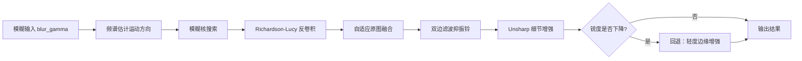
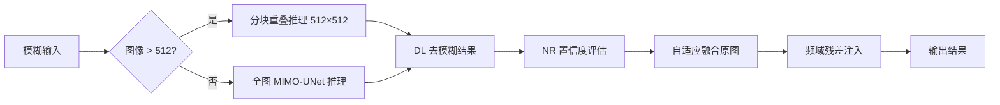

0# 改进组算法说明：HAP-Deblur 与 NRC-HybridNet

本文档说明两个改进组去模糊算法的实现原理、流程与创新点，对应代码分别为 `deblur_wiener.py` 与 `deblur_dl.py`。

---

## 一、HAP-Deblur（Hybrid Adaptive Parallel Deblur）

**核心思想**：不依赖深度学习，用**传统空频结合**的方式做运动去模糊——先在频域估计模糊核并反卷积，再在空域去伪影、增强细节，最后用自适应机制防止「越去越糊」。

### 整体流程



### 1. 频域：运动模糊核估计

运动模糊可近似为一条线段状 PSF（点扩散函数）。代码分两步：

**① 频谱方向估计**

对灰度图做 FFT，在 log 频谱上沿不同角度积分能量，能量最大的方向即为模糊方向：

```python
# deblur_wiener.py - estimate_angle_from_spectrum
f = np.fft.fftshift(np.fft.fft2(gray))
ps = np.log1p(np.abs(f))
# 遍历 0~180°，沿各方向在频谱上积分，取能量最大方向
```

**② 核长度 + 方向搜索**

在估计方向 ±15° 范围内，对长度 {11, 15, 19} 构造运动核，用 RL 反卷积试跑，选**拉普拉斯锐度最高**的核：

```python
# deblur_wiener.py - estimate_motion_kernel
coarse_angle = estimate_angle_from_spectrum(gray)
angles = {coarse_angle, coarse_angle±15}
return _search_kernel(img, lengths=(11, 15, 19), angles=angles)
```

运动核 `motion_psf(length, angle)` 在指定角度上画一条线段并归一化，模拟相机运动造成的模糊。

### 2. 频域：Richardson-Lucy 反卷积

用估计出的 PSF，对 RGB 三通道分别做 RL 迭代反卷积（比维纳滤波更适合运动模糊）：

```python
# deblur_wiener.py - rl_deconv
for c in range(3):
    restored = richardson_lucy(channel, psf, num_iter=12)
```

RL 是一种迭代反卷积算法，通过交替估计清晰图与噪声，逐步恢复被模糊的细节。

### 3. 空域：后处理

| 步骤 | 函数 | 作用 |
|------|------|------|
| 自适应融合 | `auto_blend_ratio` | 在 0~20% 范围内选最优融合比例，避免错误核带来伪影 |
| 双边滤波 | `spatial_refine` | 抑制 RL 反卷积产生的振铃/噪声 |
| Unsharp | `unsharp_enhance` | 增强边缘细节 |

自适应融合公式：

$$
I_{\text{merged}} = (1-\alpha) \cdot I_{\text{blur}} + \alpha \cdot I_{\text{restored}}, \quad \alpha \in [0, 0.20]
$$

$\alpha$ 由无参考锐度评分自动选取，使融合后图像锐度最高。

### 4. 安全机制：锐度回退

若处理后锐度反而下降，则放弃去模糊，退化为轻度边缘增强（`detailEnhance` + 弱 Unsharp），避免「越处理越差」：

```python
if out_sharp < input_sharp * 0.995:
    merged = mild_enhance_fallback(img)  # 回退
```

### 5. 批处理 / 视频优化

- **序列级共享核**：同一 GOPRO 序列只估计一次模糊核，后续帧复用（`evaluate_wiener.py`），大幅提速。
- **视频 3 帧中值融合**：`temporal_fuse` 对最近 3 帧去模糊结果取中值，降低帧间噪声。

### 特点总结

| 优点 | 局限 |
|------|------|
| 无需 GPU / 深度学习 | 单张约 3.8 s，较慢 |
| 可解释性强（核方向、长度可见） | 依赖核估计准确性，复杂模糊效果有限 |
| PSNR ~24.1，接近 baseline | 不如 DL 方法 |

---

## 二、NRC-HybridNet（No-Reference Confidence Hybrid Network）

**核心思想**：用**预训练深度学习网络**（MIMO-UNet）做主力去模糊，再用**无参考（NR）后处理**自适应融合、回补纹理，兼顾质量与鲁棒性。

### 整体流程



### 1. 深度主干：MIMO-UNet

- **网络结构**：多输入多输出 U-Net，编码器-解码器架构，内部在 **1/4、1/2、全分辨率** 三个尺度做监督输出。
- **推理**：只取最后一个全分辨率输出 `preds[-1]`。
- **加速**：GPU + FP16 混合精度（`torch.autocast`）。

```python
# deblur_dl.py - _infer_tensor
with torch.autocast(device_type="cuda", dtype=torch.float16):
    out = net(tensor)[-1]  # 只取全分辨率输出
```

MIMO-UNet 在 GoPro 数据集上预训练，可直接迁移到本项目的 `blur_gamma` 数据。

### 2. 分块重叠推理（大图 / 1080p 视频）

图像大于 512×512 时，切成 512×512 块，32 px 重叠，Hann 窗加权融合，避免块边界伪影：

```python
# deblur_dl.py - infer_tiled
acc[y:y1, x:x1] += patch_out * hann_window
weight[y:y1, x:x1] += hann_window
output = acc / weight
```

这使 1080p 视频帧也能在有限显存下稳定推理。

### 3. NR 置信度融合（创新点 1）

**不需要清晰真值**，用两个无参考指标评估 DL 输出是否可信：

```python
# deblur_dl.py - nr_confidence
sharp_gain = (s1 - s0) / (s0 + ε)           # 锐度提升比例
corr = mean(min(g1, g0×1.5) / (g0 + ε))     # 梯度一致性
confidence = 0.55 × sharp_gain + 0.45 × corr
```

融合比例由置信度决定：

$$
\alpha = \text{clip}(0.55 + 0.35 \times C, \ 0.55, \ 0.95)
$$

$$
I_{\text{out}} = (1-\alpha) \cdot I_{\text{blur}} + \alpha \cdot I_{\text{DL}}
$$

置信度高 → 更信任 DL 输出；置信度低 → 更保守，保留更多原图。

### 4. 频域残差注入（创新点 2）

DL 网络容易过平滑，丢失纹理。从**原模糊图**提取高频分量，按比例加回融合结果：

```python
# deblur_dl.py - freq_residual_inject
low = GaussianBlur(blur)
high = blur - low              # 原图高频纹理
out = merged + strength × high
```

相当于：DL 负责去模糊（低频/结构），原图高频负责补纹理（细节）。

### 5. 视频时序 EMA

视频模式下，对相邻帧 DL 结果做指数滑动平均，抑制帧间闪烁：

```python
# deblur_dl.py - temporal_ema
output = β × curr + (1-β) × prev,  β=0.75
```

### 6. 训练与 fine-tune

可通过 `train_deblur.py` 在本地 GOPRO 数据上继续训练，使模型更适应 `blur_gamma` 分布：

- 多尺度 Charbonnier Loss（对 1/4、1/2、1.0 三个输出分别计算，GT 对应缩放）
- 训练权重保存在 `models/finetune/best.pkl`
- 修改 `deblur_dl.py` 中 `MODEL_PATH` 即可加载自训练模型

### 特点总结

| 优点 | 局限 |
|------|------|
| PSNR ~25.8，优于 baseline 和 HAP | 需要 GPU + yolov8 环境 |
| 单张 ~580 ms，比 HAP 快约 7 倍 | 模型 27 MB，需预训练权重 |
| NR 融合 + 残差注入，鲁棒性好 | 黑盒，可解释性弱 |

---

## 三、两者对比

| 维度 | HAP-Deblur | NRC-HybridNet |
|------|------------|---------------|
| **方法类型** | 传统空频结合 | 深度学习 + NR 后处理 |
| **模糊核** | 手工估计线段 PSF | 网络端到端学习 |
| **去模糊核心** | Richardson-Lucy 反卷积 | MIMO-UNet 前向推理 |
| **空域处理** | 双边滤波 + Unsharp | NR 融合 + 高频残差注入 |
| **安全机制** | 锐度回退 | NR 置信度自适应 α |
| **PSNR** | 24.1 dB | **25.8 dB** |
| **速度** | ~3877 ms/张 | **~580 ms/张** |
| **环境** | base（OpenCV + skimage） | yolov8（PyTorch + CUDA） |
| **可解释性** | 高（可见核方向/长度） | 低（黑盒网络） |
| **适用场景** | 无 GPU、需可解释 | 有 GPU、追求质量与速度 |

---

## 四、创新点汇总（汇报用）

### HAP-Deblur

1. **频谱方向估计 + 粗精两阶段核搜索**：先 FFT 估方向，再小范围搜索核长度。
2. **RL 反卷积 + 空域联合后处理**：频域恢复 + 双边/Unsharp 抑伪影。
3. **无参考锐度自适应融合 + 回退机制**：防止错误核导致效果变差。
4. **序列/视频共享核 + 时域中值融合**：批处理提速与视频稳定性。

### NRC-HybridNet

1. **MIMO-UNet 多尺度 DL 去模糊**：GoPro 预训练，可 fine-tune。
2. **NR 置信度融合**：无需 GT，根据锐度/梯度自动决定融合比例。
3. **频域残差注入**：DL 去模糊 + 原图高频补纹理，减轻过平滑。
4. **分块重叠推理 + 视频时序 EMA**：大图/视频工程化部署。

---

## 五、相关代码文件

| 算法 | 核心实现 | 评估脚本 | 批处理入口 |
|------|----------|----------|------------|
| HAP-Deblur | `deblur_wiener.py` | `evaluate_wiener.py` | `process_media.py --method hap` |
| NRC-HybridNet | `deblur_dl.py` | `evaluate_dl_deblur.py` | `process_media.py --method dl` |
| NRC 训练 | `train_deblur.py` | — | — |
| 网络结构 | `models/mimo_unet.py` | — | — |
